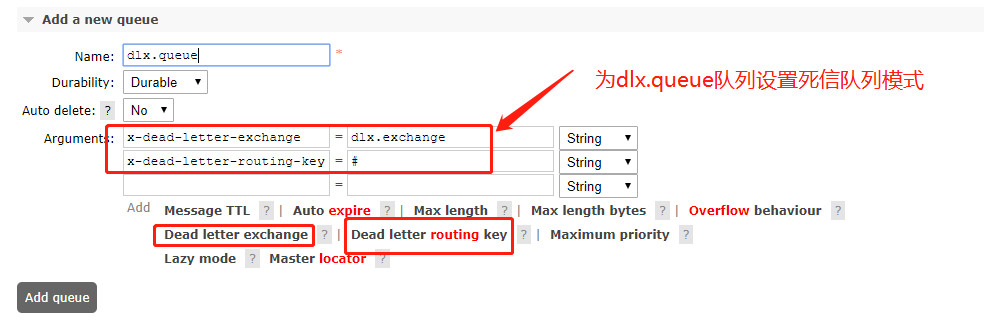

# demo-springboot-rabbit-dlx
测试RabbitMQ的死信队列 dead-letter-exchange

### 什么是死信队列

- 死信队列其实并不是一个队列，而是一个死信交换机，它和一般的交换机没有任何区别，只是用来专门转发死信消息到特定的队列中
- 当某个队列设置了死信队列模式，并存在死信的时候，该死信消息就会别转发到死信交换机，由死信交换机路由到特定的队列中


### 消息变成死信队列由三种情况

- 消息被ack拒绝(basic.reject/basic.nack)，并且requeue = false被拒绝重回队列
- 消息TTL过期，就会被转发到死信队列
- 队列达到最大长度，溢出的消息就会被转移到死信队列


### 怎么实现？

- 说白了，就是建立一个正常的交换机，作为概念上的死信交换机，建立特定的队列，用户接收由死信交换机路由过来的死信消息
- 在正常的队列中设置死信队列模式，当队列一定出现了死信，就将该死信路由到死信交换机，由交换机路由给特定的队列
- 通常可以用来做重试，或者是延迟队列等



```java
 public void dleTest() {

        /**
         * 死信交换机和死信队列
         */
        TopicExchange dleExchange = new TopicExchange("snailmann.dle.exchange");
        Queue dleQueue = new Queue("snailmann.dle.queue");
        rabbitAdmin.declareExchange(dleExchange);
        rabbitAdmin.declareQueue(dleQueue);
        rabbitAdmin.declareBinding(BindingBuilder.bind(dleQueue)
                .to(dleExchange)
                .with("#"));

        /**
         * 设置了死信队列模式和队列TTL过期实际的普通队列
         */
        Map<String, Object> arguments = new HashMap<>(10);
        arguments.put("x-dead-letter-exchange", dleExchange.getName());
        arguments.put("x-dead-letter-routing-key", "#");
        arguments.put("x-message-ttl", 10000); //队列的过期实际为10s
        Queue ttlQueue = new Queue("snailmann.ttl.queue", true, false, false, arguments);
        rabbitAdmin.declareQueue(ttlQueue);

        /**
         * 我们往有过期时间的ttl队列，发送一个消息，而且并没有消费者去消费
         * 最后我们发现本应该在snailmann.ttl.queue队列的消息，过了10s后，被转发到snailmann.dle.queue队列中
         */
        rabbitTemplate.convertAndSend(ttlQueue.getName(), "hello world");

    }
```