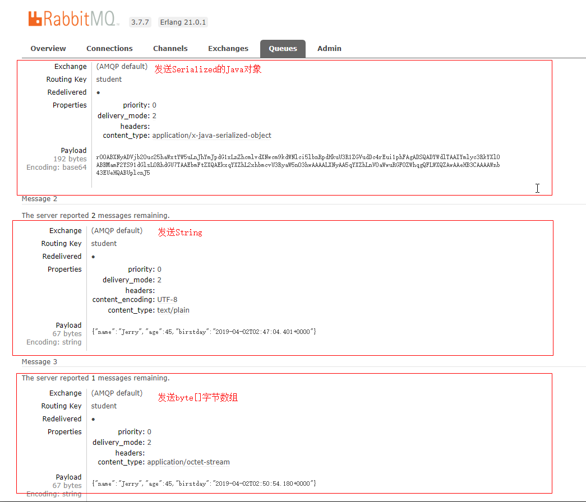

# demo-springboot-rabbit-variousproducer

测试rabbitmq各式各样的消息发送方式


## SimpleMessageConverter

- SimpleMessageConvertor是spring rabbitmq api的默认MessageConverter
- SimpleMessageConvertor默认只支持byte[], String , 实现了Serializable接口的对象

### 序列化异常
如果消息的payload不是byte[],String, 实现了Serializable接口的Object, 那么使用该SimpleMessageConvertor消息转换器，就会抛出异常
```
java.lang.IllegalArgumentException: SimpleMessageConverter only supports String, byte[] and Serializable payloads, received: com.snailmann.rabbitmq.variousproducer.entity.Student

    at org.springframework.amqp.support.converter.SimpleMessageConverter.createMessage(SimpleMessageConverter.java:161)
	at org.springframework.amqp.support.converter.AbstractMessageConverter.createMessage(AbstractMessageConverter.java:88)
	at org.springframework.amqp.support.converter.AbstractMessageConverter.toMessage(AbstractMessageConverter.java:70)
	at org.springframework.amqp.support.converter.AbstractMessageConverter.toMessage(AbstractMessageConverter.java:58)
	at org.springframework.amqp.rabbit.core.RabbitTemplate.convertMessageIfNecessary(RabbitTemplate.java:1726)
	at org.springframework.amqp.rabbit.core.RabbitTemplate.convertAndSend(RabbitTemplate.java:1048)
	at org.springframework.amqp.rabbit.core.RabbitTemplate.convertAndSend(RabbitTemplate.java:1030)
	...

```


### 传输byte[],String, 实现了Serializable接口的Object


<center>

</center>

发送byte[]字节数组


|context_type|payload|
| :--- | :--- |
|application/octet-stream|{"name":"Jerry","age":45,"birstday":"2019-04-02T02:50:54.180+0000"}


发送String字符串


| content_encoding|context_type|payload|
| :--- | :--- | :--- |
| UTF-8| text/plain |{"name":"Jerry","age":45,"birstday":"2019-04-02T02:52:00.399+0000"}


发送实现了Serializable接口的Object | 如果没有实现Serializable接口是会报错的


|context_type|payload|
| :--- | :--- |
| application/x-java-serialized-object |rO0ABXNyADVjb20uc25haWxtYW5uLnJhYmJpdG1xLnZhcmlvdXNwc...省略|


## Jackson2JsonMessageConvertor

- 将所有东西都使用Json来序列化和反序列化


### 传输byte[],String, 实现了Serializable接口的Object

<center>

</center>


发送String对象

|_TypeId |contend_encoding |context_type|payload|
| :--- | :--- | :--- | :--- |
| java.lang.String| UTF-8 | application/json | "{\"name\":\"Jerry\",\"age\":45,\"birstday\":\"2019-04-02T08:32:04.384+0000\"}" |


发送byte[]数组


|_TypeId |contend_encoding |context_type|payload|
| :--- | :--- | :--- | :--- |
| [B| UTF-8 | application/json | "eyJuYW1lIjoiSmVycnkiLCJhZ2UiOjQ1LCJiNDE6MzkuODI3KzAwMDAifQ==" |


发送Java对象 | 不用管是否


|_TypeId |contend_encoding |context_type|payload|
| :--- | :--- | :--- | :--- |
| com.snailmann.xxx.entity.Student| UTF-8 | application/json | {"name":"Jerry","age":45,"birstday":1554194014200} |

